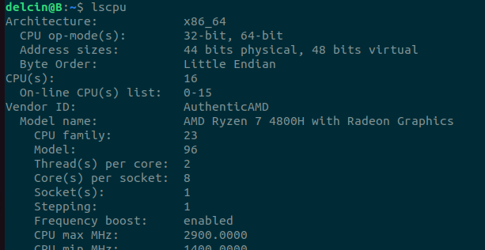

# Multi-tasking Computers

Computers are excellent at multi-tasking, modern computing devices allows multiple processes
to be running at the same time.

## What is a thread?

Threads are an abstraction and a virtualization technique used to share CPU resources among
different processes. If you checkout your mobile or PC specifications you would observe that
your computing device allows you to run more processors than the available CPUs.
This is achieved because of the virtualization enabled by the thread abstraction.

We will see that using rust `std` crate in a single process we can spawn up multiple threads,
only limited by the number of os threads.

There are three types of threads

1. Hardware/CPU threads
1. Native os threads
1. Green/User level threads

## What is a CPU thread?

If you are running linux then `lscpu` command will list the number of CPUs your system has.
Below is the example result from my system,

It's showing that my system has 16 CPUs and 2 threads per CPU and in total 32 CPU threads.
This means that both the threads will share the same CPU but they have different execution
context like separate registers but share the same CPU cache. Yes each CPU has their own cache.

## What is a OS thread?

To know the number of OS threads in linux execute the following command,

```bash
cat /proc/sys/kernel/threads-max
```

It's just an abstraction over hardware threads.

When a process starts a separate thread is allocated to that process which is called the main thread.
In rust you start the process using `cargo run` command.

In rust you can spawn a new thread from the main thread like shown below,
Execute the example shown in [unmonitored thread](./demo/src/unmonitored_spawn.rs) multiple times
to observe the strange behaviour of multi-threaded programming. What you just saw is called
*undefined behaviour*.

If you want the spawned thread to finish it's job completely use the `join` function on the handle as
shown here [monitored thread](./demo/src/monitored_spawn.rs). This is a *well defined behaviour*.

The number of threads a process can invoke is only limited by the number of OS threads.

## Green/User level threads

Rust does not natively support these threads. There is different falvours of implementing green threads
like co-routines by Go, actor models by Erlang, NodeJS which is an asynchronous runtime for JS etc.,
has their own semantics and theory to provide safe APIs to write multi-threaded code.

Generally Green threads allows the programmer to invoke `N` threads where `N >> OS_THREADS_MAX`.
Essentially it's just an abstraction over OS threads.

In Rust we have external crates like `tokio` which provides the runtime to manage the green threads.
We will be covering them in the final module_8.
